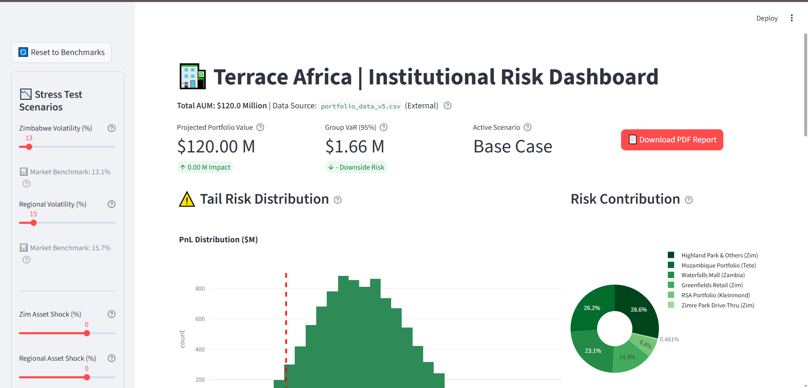
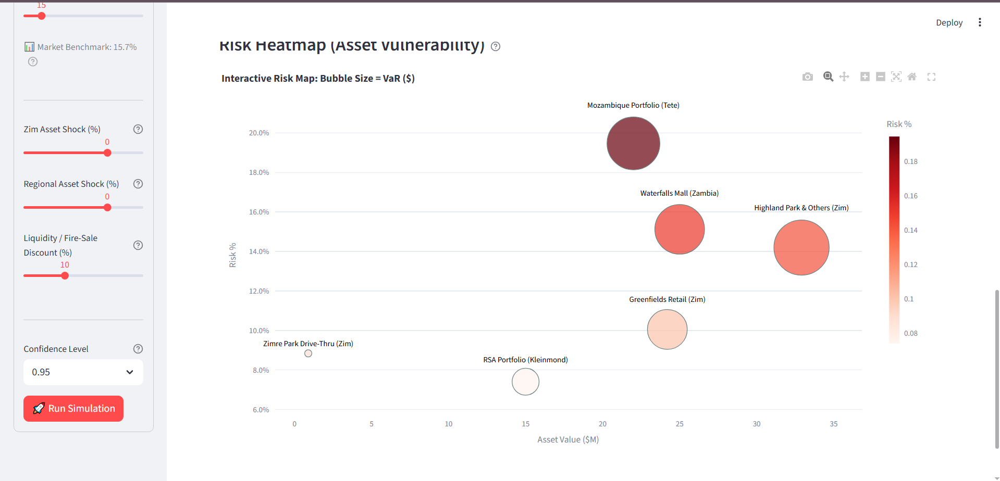
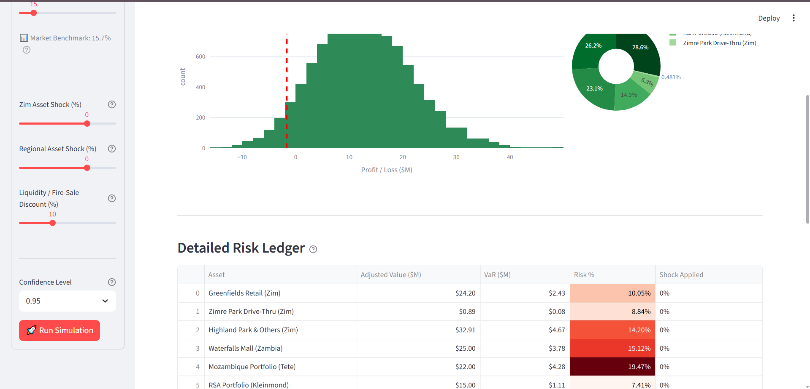
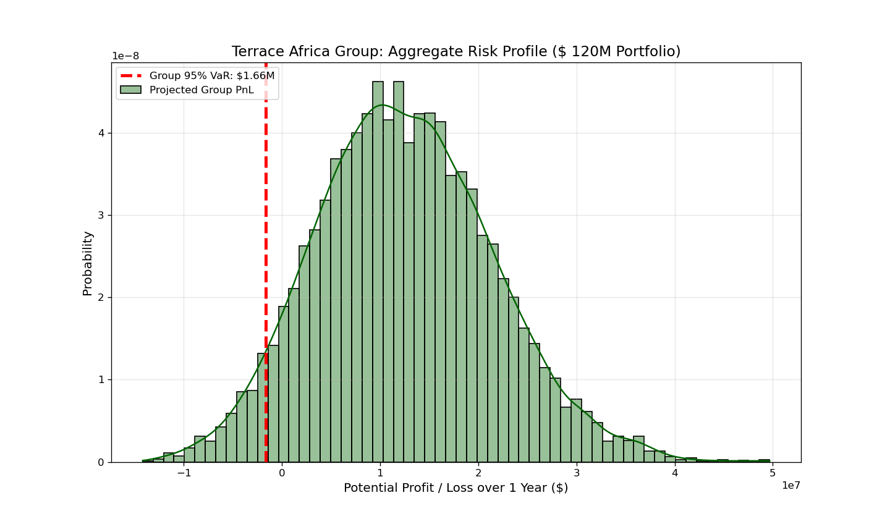
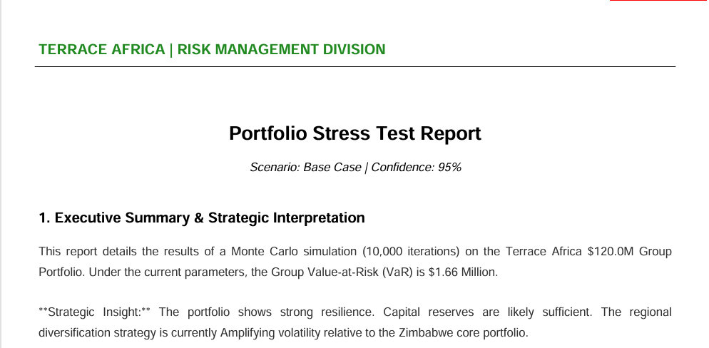
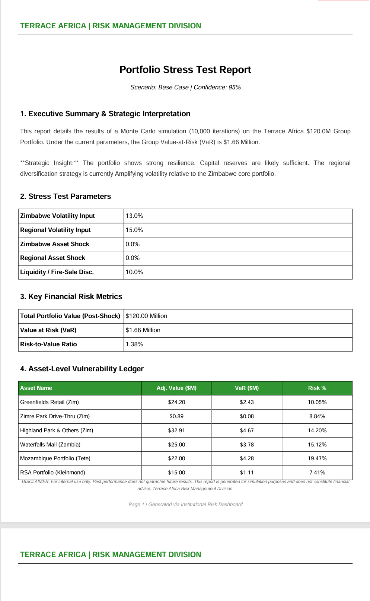

# 🏦 Terrace Africa Institutional Risk Dashboard



## 📋 Project Overview
This project is an **Enterprise Risk Management (ERM) System** developed for Terrace Africa to quantify and manage downside exposure across a $120M real estate portfolio.

It bridges the gap between static financial reports and dynamic risk modeling by allowing the Investment Committee to run real-time "What-If" scenarios (e.g., Currency Devaluation, Regional Contagion) and instantly generate board-ready PDF reports.

## 🧰 Tech Stack
* **Python 3.10+:** Core logic and simulation engine.
* **Streamlit:** Interactive web dashboard interface.
* **NumPy & Pandas:** High-performance Monte Carlo simulations (GBM) and data wrangling.
* **Plotly:** Interactive financial charting and heatmaps.
* **FPDF:** Automated generation of board-ready PDF reports.
* **Matplotlib & Seaborn:** Statistical visualizations (in research notebooks).

### Key Features
* **Monte Carlo Engine:** Runs 10,000 simulations using Geometric Brownian Motion (GBM).
* **Liquidity Stress Testing:** Incorporates "Fire-Sale" discounts to model real estate illiquidity.
* **Automated Governance:** Logs every simulation run (User, Timestamp, Parameters) for audit trails.
* **PDF Reporting:** One-click generation of professional risk reports.

## 📂 Project Structure
The repository is organized to separate data science logic, user interface code, and assets.

---

```text
Terrace-Africa-Institutional-Risk-Dashboard/
│
├── assets/                          # Folder for your screenshots
│   ├── dashboard_main.png           # (Screenshot of the main dashboard view)
│   ├── dashboard_heatmap.png        # (Screenshot of the risk heatmap)
    ├── dashboard_risk_ledger.png    # (Screenshot of risk ledger)
│   ├── report_cover.png             # (Screenshot of PDF Report Page 1)
│   ├── report_metrics.png           # (Screenshot of PDF Report Page 2)
│   └── var_model_chart.png          # (Screenshot from your initial Jupyter model)
│
├── docs/                            # Documentation folder
│   ├── METHODOLOGY.md               # The math behind the model
│   └── DOCUMENTATION.md             # Technical code documentation
│
├── src/                             # Source code
│   ├── dashboard.py                 # The main Streamlit App
│   └── risk_model_initial.ipynb     # Your initial Jupyter Notebook (Untitled.ipynb)
│
├── .gitignore                       # Files to ignore in git
├── requirements.txt                 # Python dependencies
├── README.md                        # Main presentation file
└── LICENSE                          # License file (Optional, but section is in README)
```
---

## 📸 Dashboard & Reports

### Interactive Risk Heatmap
*Visualizes asset vulnerability by size (Value) and color (Risk Intensity).*



### Group-Wide VaR Model (Initial Calibration)
*The underlying statistical distribution used to calibrate the live dashboard.*


### Automated PDF Risk Reports
*The system auto-generates these documents for board meetings.*
| Executive Summary | Detailed Metrics |
| :---: | :---: |
|  |  |

---

## 🛠️ Installation & Usage

1.  **Clone the repository**
    ```bash
    git clone [https://github.com/stilhere4huniid/Terrace-Africa-Institutional-Risk-Dashboard.git](https://github.com/stilhere4huniid/Terrace-Africa-Institutional-Risk-Dashboard.git)
    ```

2.  **Install Dependencies**
    ```bash
    pip install -r requirements.txt
    ```

3.  **Run the Dashboard**
    ```bash
    streamlit run src/dashboard.py
    ```

4.  **Operational Note**
    ```bash
    * The app will auto-generate a `portfolio_data_final.csv` file on the first run.
    * Edit this CSV to update live asset valuations.
    ```
---

## ⚠️ Disclaimer: Data Integrity & Simulation
**This is an independent Data Science portfolio project created strictly for educational and demonstration purposes.**

I am not affiliated with Terrace Africa in an official advisory capacity via this public repository. Please note the following regarding data quality:
1.  **Valuations:** The **Assets Under Management (AUM)** figure ($120M) and asset-specific valuations are based on provided/public data and are the only "hard" figures in this model.
2.  **Simulations:** All other financial figures—including rental yields, volatility assumptions, correlation matrices, and stress test outcomes—are **hypothetical simulations** used solely to demonstrate financial modeling capabilities.

This tool does not constitute professional investment advice, and the creator assumes no liability for decisions made based on its outputs.

---

## 📄 License
This project is licensed under the MIT License - see the [LICENSE](LICENSE) file for details.

---

## 📞 Contact & Portfolio

**Adonis Chiruka**
*Data Science & Financial Modeling*

* 📧 **Email:** stillhere4hunnid@gmail.com
* 🔗 **LinkedIn:** [Adonis Chiruka](https://www.linkedin.com/in/adonis-chiruka-70b265323)
* 🐙 **GitHub:** [stilhere4huniid](https://github.com/stilhere4huniid)
